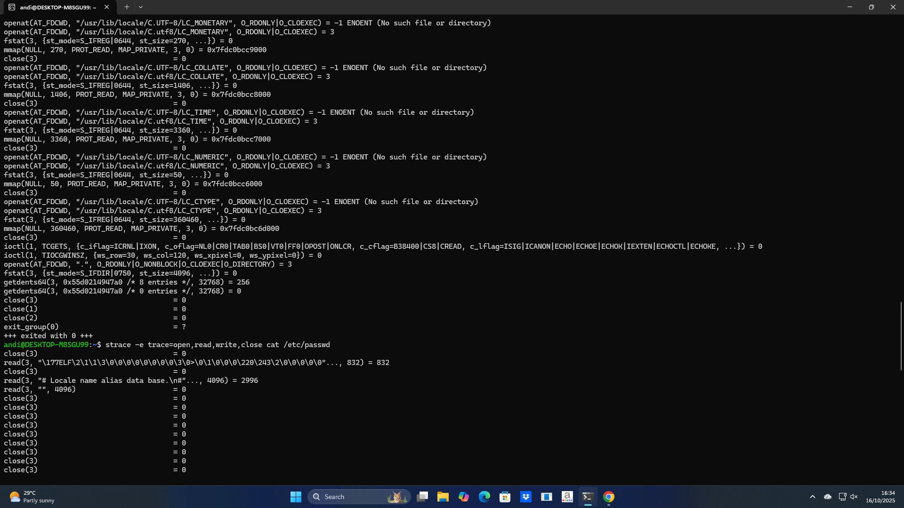
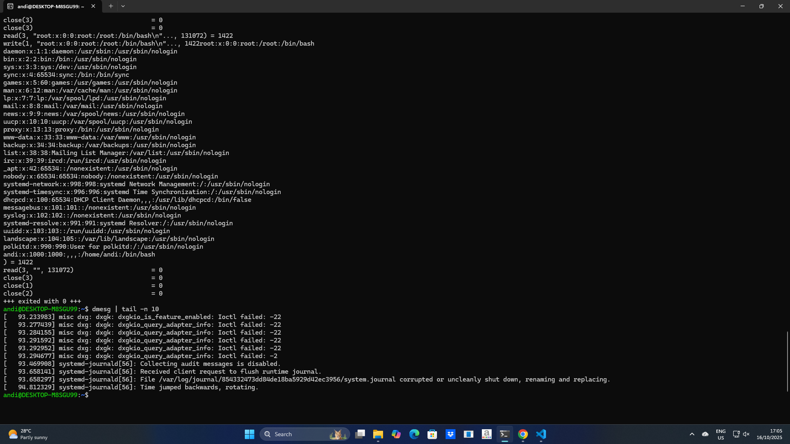
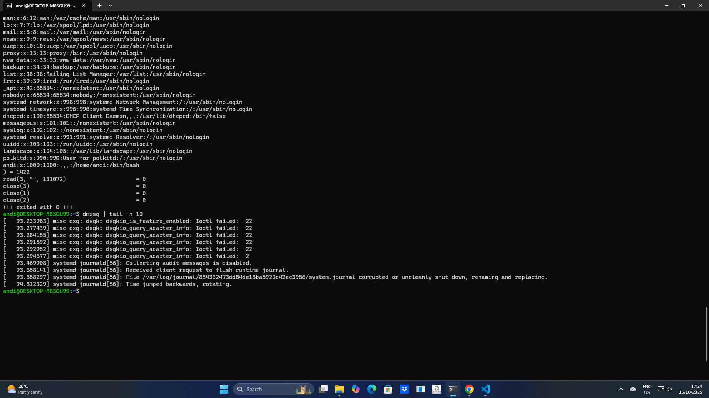
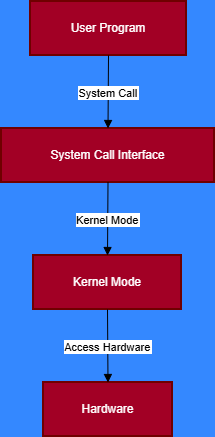

# Laporan Praktikum Minggu [X]
Topik: syscall-structures
---
## Identitas
- **Nama**  : Andi pratama   
- **NIM**   : 250202975  
- **Kelas** : 1IKRA
---
## Tujuan
Tuliskan tujuan praktikum minggu ini.  
Contoh:  
> Mahasiswa mampu menjelaskan fungsi utama sistem operasi dan peran kernel serta system call.
> Tujuan mempelajari mekanisme system call dan struktur sistem operasi adalah untuk memahami bagaimana sebuah program dapat berkomunikasi dengan kernel dan perangkat keras. Dengan memahami konsep ini, kita dapat mengetahui alur kerja sistem dari saat perintah dijalankan hingga perangkat keras meresponsnya. Pengetahuan ini sangat penting karena system call menjadi jembatan antara ruang pengguna (user space) dan ruang kernel (kernel space), sehingga proses eksekusi dapat berjalan dengan aman dan terkontrol.
---

## Dasar Teori
Tuliskan ringkasan teori (3–5 poin) yang mendasari percobaan.
1. System call sebagai penghubung — System call menjadi jembatan antara program pengguna dan kernel untuk mengakses sumber daya sistem secara aman.
2. Struktur sistem operasi berlapis — Kernel, file system, device driver, dan user interface saling terhubung untuk mengatur jalannya sistem.
3. Pengelolaan sumber daya terpusat — Sistem operasi mengontrol CPU, memori, dan perangkat keras agar tidak terjadi konflik.
4. Keamanan dan stabilitas sistem — Akses ke sumber daya penting difilter melalui kernel untuk mencegah kerusakan.
5. Dasar pemahaman sistem komputer — Memahami system call dan struktur OS membantu dalam debugging, pengembangan, dan administrasi sistem.

---

## Langkah Praktikum
1. **Setup Environment**
   - Gunakan Linux (Ubuntu/WSL).
   - Pastikan perintah `strace` dan `man` sudah terinstal.
   - Konfigurasikan Git (jika belum dilakukan di minggu sebelumnya).

2. **Eksperimen 1 – Analisis System Call**
   Jalankan perintah berikut:
   ```bash
   strace ls
   ```
   > Catat 5–10 system call pertama yang muncul dan jelaskan fungsinya.  
   Simpan hasil analisis ke `results/syscall_ls.txt`.

3. **Eksperimen 2 – Menelusuri System Call File I/O**
   Jalankan:
   ```bash
   strace -e trace=open,read,write,close cat /etc/passwd
   ```
   > Analisis bagaimana file dibuka, dibaca, dan ditutup oleh kernel.

4. **Eksperimen 3 – Mode User vs Kernel**
   Jalankan:
   ```bash
   dmesg | tail -n 10
   ```
   > Amati log kernel yang muncul. Apa bedanya output ini dengan output dari program biasa?

5. **Diagram Alur System Call**
   - Buat diagram yang menggambarkan alur eksekusi system call dari program user hingga kernel dan kembali lagi ke user mode.
   - Gunakan draw.io / mermaid.
   - Simpan di:
     ```
     praktikum/week2-syscall-structure/screenshots/syscall-diagram.png
     ```

6. **Commit & Push**
   ```bash
   git add .
   git commit -m "Minggu 2 - Struktur System Call dan Kernel Interaction"
   git push origin main
   ```

---

@@ -46,19 +53,29 @@ Sertakan screenshot hasil percobaan atau diagram:






---

## Analisis
- Jelaskan makna hasil percobaan.  
- Hubungkan hasil dengan teori (fungsi kernel, system call, arsitektur OS).  
- Apa perbedaan hasil di lingkungan OS berbeda (Linux vs Windows)?  
- Jelaskan makna hasil percobaan.
  Makna dari hasil percobaan tersebut adalah untuk menunjukkan bagaimana program berinteraksi langsung dengan sistem operasi melalui mekanisme system call. Saat program dijalankan, setiap instruksi yang membutuhkan akses ke sumber daya — seperti menulis ke layar, membaca file, atau membuka berkas tidak dilakukan secara langsung oleh program, melainkan melalui kernel.  
- Hubungkan hasil dengan teori (fungsi kernel, system call, arsitektur OS).
  Hasil percobaan menunjukkan bahwa setiap program berinteraksi dengan sistem operasi melalui system call yang diteruskan ke kernel. Kernel berfungsi mengatur dan mengendalikan akses ke sumber daya sistem seperti memori, CPU, dan perangkat keras. Hal ini membuktikan teori bahwa dalam arsitektur sistem operasi, system call menjadi jembatan antara user space dan kernel space, sehingga proses berjalan aman, efisien, dan terstruktur. 
- Apa perbedaan hasil di lingkungan OS berbeda (Linux vs Windows)?
  Pada Linux, system call bersifat lebih transparan dan mudah diamati menggunakan alat seperti strace. Setiap interaksi program dengan kernel dapat dilacak dengan jelas, misalnya saat membuka file atau menulis ke layar. Hal ini karena Linux dirancang sebagai sistem terbuka (open source), sehingga struktur system call-nya terdokumentasi dengan baik.

Sementara itu, pada Windows, system call bersifat lebih tertutup dan kompleks. Akses langsung ke daftar system call tidak semudah di Linux karena Windows menggunakan lapisan tambahan seperti Win32 API. Akibatnya, hasil percobaan serupa tidak dapat dilacak langsung dengan perintah sederhana seperti strace, dan membutuhkan alat khusus seperti Process Monitor.


## Analisis tabel observasi
   ###  Tabel Analisis Perintah

| No | Perintah | Fungsi Utama | Contoh Output |
|----|-----------|---------------|----------------|
| 1 | strace ls | Melacak seluruh system call yang dijalankan ketika perintah ls dieksekusi. | openat(AT_FDCWD, "/etc/ld.so.cache", O_RDONLY|O_CLOEXEC) |
| 2 | strace -e trace=open,read,write,close cat /etc/passwd | Memfilter dan menampilkan hanya system call tertentu (seperti open, read, write, close) yang digunakan saat membaca file /etc/passwd. | read(3, "\177ELF\2\1\1\3\0\0\0\0\0\0\0\0\0\3\0>\0\1\0\0\0...", 220) |
| 3 | dmesg tail | Menampilkan pesan kernel terbaru yang muncul selama sistem beroperasi. | [4067.875372] sd 0:0:2:0: [sdb] Mode Sense: 1f 00 00 08 |

*Sumber:*  
- [https://www.techtarget.com/searchsoftwarequality/](https://www.techtarget.com/searchsoftwarequality/)

---

## Kesimpulan
Tuliskan 2–3 poin kesimpulan dari praktikum ini.
1. System call menjadi penghubung utama antara program dan kernel, memungkinkan akses ke sumber daya sistem secara aman dan terstruktur.
2. Kernel berperan sebagai pengendali sistem, mengatur proses, memori, dan perangkat keras agar program berjalan stabil dan efisien.
3. Perbedaan OS memengaruhi cara observasi, di mana Linux lebih terbuka dan mudah dilacak, sedangkan Windows menggunakan lapisan API tambahan sehingga prosesnya lebih tersembunyi.

---


## Refleksi Diri
Tuliskan secara singkat:
- Apa bagian yang paling menantang minggu ini?
  bagian menantang di munggu ii ketika saya memaksakan belajar hal baru di perkuliahan 
- Bagaimana cara Anda mengatasinya?
  beradaptasi di lingkungan perkuliahan 

---

**Credit:**  
_Template laporan praktikum Sistem Operasi (SO-202501) – Universitas Putra Bangsa_
